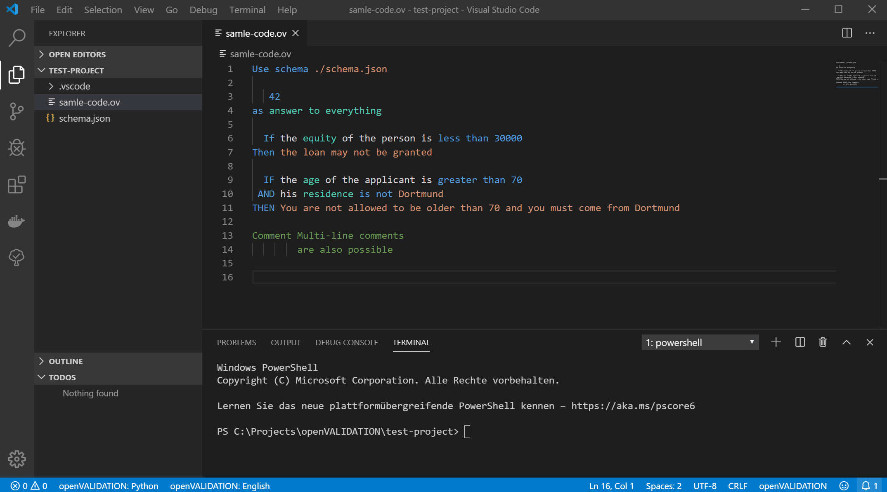
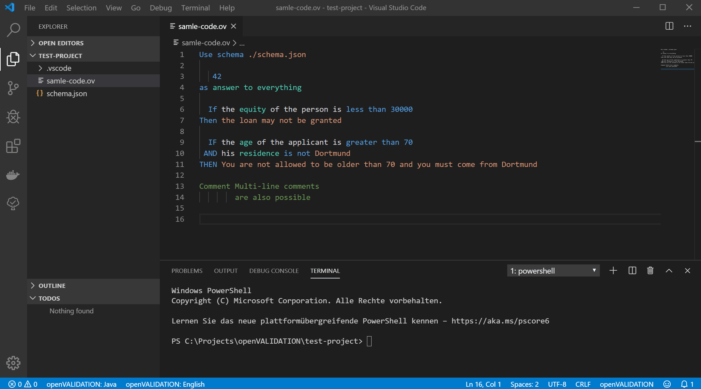

# Language Support for openVALIDATION for Visual Studio Code

This extension provides support for the domain specific language [openVALIDATION](https://github.com/openvalidation/openvalidation).
The extension uses the [ov-language-server](https://github.com/openvalidation/ov-language-server) to provide the language features.

## Requirements

This extension starts the language-server, which requires the REST-API of openVALIDATION. To be independent of the internet connection, the REST-API get started by the language-server. Because openVALIDATION was written in Java, Java is required to run the extension.
For Windows, we deliver the JRE of openJDK8 to avoid this. But on other platforms like Linux, Java is required to run the extension. We're working on a better solution.

## Features

All [features](https://github.com/openvalidation/ov-language-server#implemented-features-of-the-protocol) that are implemented in the language-server are provided here. In addition to the features of the [Language-Server-Protocol](https://microsoft.github.io/language-server-protocol/) we provide semantical highlighting, which is also implemented in the language-server.

Besides, the extension generates code from the written openVALIDATION code.
The programming language can be picked from the available programming languages.
Also, the folder where the code should be generated can be picked in the settings.

## Extension Settings

This extension contributes the following settings:

- `openVALIDATION.culture`: specifies the natural language of the openVALIDATION code
- `openVALIDATION.language`: defines the programming language of the generated code
- `openVALIDATION.codeGeneration.path`: defines the folder where the code should be generated to

The language and culture can also be changed with the status bar:

## Known Issues

Nearly all currently released features of openVALIDATION are supported here. But we currently don't support multiple files which are bundled with the [import](https://docs.openvalidation.io/grammatik/strukturierung-des-regelwerkes#splitting-the-set-of-rules-into-several-files) command. We still need to find a way to implement language features for multiple files in openVALIDATION.

## Release Notes

### 0.1.0

Initial release.
